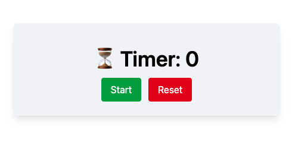

# Simple Timer

This is a simple timer app to show how to use the `useRef` hook to persist values across re-renders.



## Usage

Install Dependencies

```bash
npm install
```

Run project

```bash
npm run dev
```
